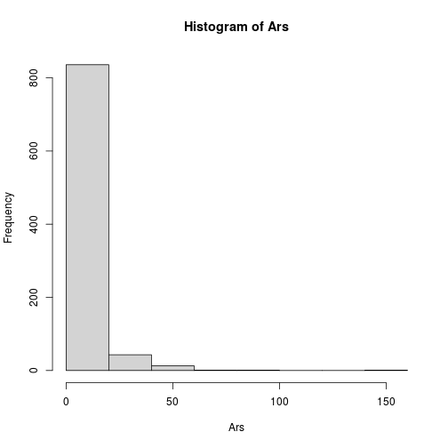
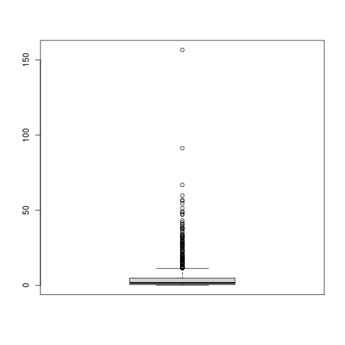
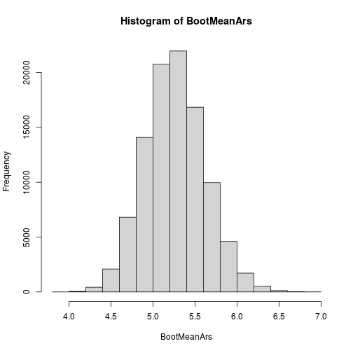
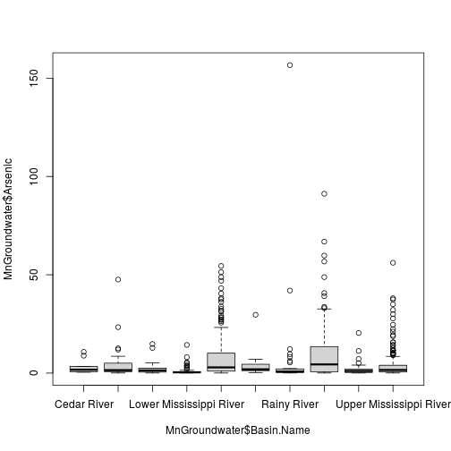
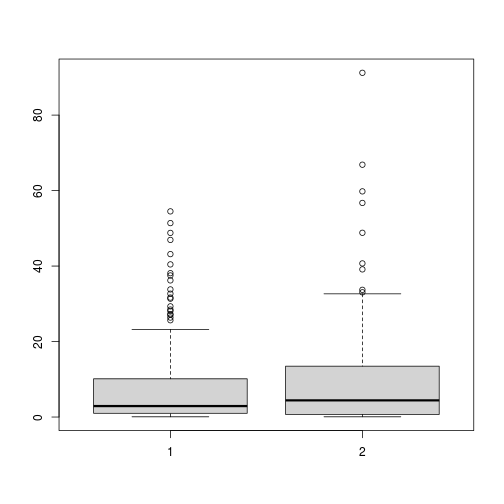
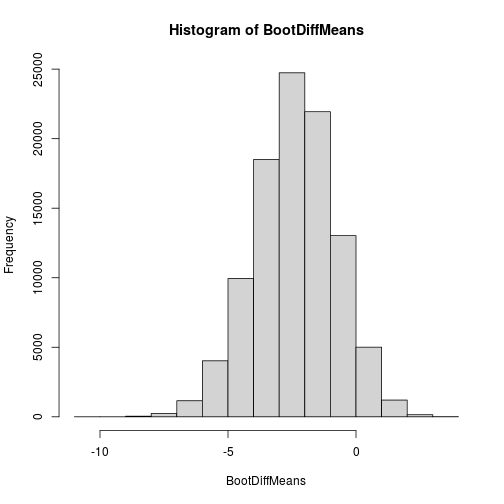
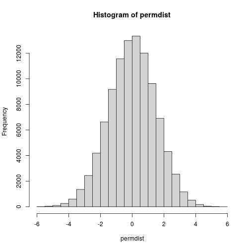

Bootstrap Confidence Intervals
========================================================
author: 
date: 
autosize: true

The data
========================================================

* Load the data set **MnGroundwater** from the **resampledata** set.
* Try **names(MnGroundwater)** just to see what variables are in the data set.

=====

The following data set contains water levels of various chemicals in the groundwater in Minnesota.  


```r
library(resampledata)
names(MnGroundwater)
```

```
 [1] "County"        "Aquifer.Group" "Water.Level"   "Alkalinity"   
 [5] "Aluminum"      "Arsenic"       "Chloride"      "Lead"         
 [9] "pH"            "Basin.Name"   
```

Goal 1
=====
We’ll use the data set to estimate the *population* mean arsenic level in the ground water.....more precisely we’ll find a *confidence interval* in which we’re confident the *population* mean lies.


EDA
====
This is for the observed sample. Why? If nothing else it will give us a common sense check on the results.
* A good way to start with data with no NAs is: **na.omit(MnGroundwater$Arsenic)**.  Assign it a name.
* Compute the following things for the data set itself:
  * mean
  * standard deviation
  * histogram
  * box plot
  * any other you think is informative
* Comment on the distribution of the data set.

Clean up data and EDA
=====


```r
Ars <- na.omit(MnGroundwater$Arsenic)
head(Ars)
```

```
[1]  1.810  0.059  1.440  6.340 10.170  6.900
```

The mean and stardard deviation of the data are:


```r
mean(Ars)
```

```
[1] 5.264037
```

```r
sd(Ars)
```

```
[1] 10.67679
```

Graphical EDA
====
We'll take a look at the distribution, via a histogram and a boxplot:


```r
hist(Ars)
```



====

```r
boxplot(Ars)
```




Description of distribution
====


This data is strongly skewed right, and has several large outliers.  We'll have to decide if it makes sense to remove the one extreme outlier whose value is over 150.  We'll leave it for now.


Bootstrap
=====

Generate the bootstrap distribution for the mean of the arsenic level.

Bootstrap solution:
====


```r
N=10^5
BootMeanArs <- numeric(N)
for (i in 1:N)
{samp <- sample(Ars, length(Ars), replace=T)
BootMeanArs[i] <- mean(samp)}
```


EDA of Bootstrap Distribution
=====
Compute the following for the bootstrap distribution.  This is a good place to ask "is the output what I expected?"
* mean
* standard deviation (called bootstrap standard error here)
* histogram, i.e. graphical representation of the bootstrap distribution

=====


```r
hist(BootMeanArs)
```



=====

```r
mean(BootMeanArs)
```

```
[1] 5.261965
```

```r
sd(BootMeanArs)
```

```
[1] 0.3565569
```


Bias
====

One new calculation for bootstrap distributions: *bias*

The *bias* is the mean of the bootstrap distribution minus the mean of the original data set.  (Of course, neither of these is the *true* mean of the population.)

It measures how much the bootstrap estimate differs from the data mean.

=====

```r
mean(BootMeanArs)-mean(Ars)
```

```
[1] -0.002071862
```


Where we are
=====

We'd like to use this bootstrap distribution to estimate the mean arsenic level in the ground water. Remember, however, that a bootstrap distribution does not estimate the mean well.  It does however represent the spread and shape well.  So, we'll generate a *confidence interval*, in which we'll have a specified level confidence that the mean lies.  That is, we'll give a range inside which we're pretty sure the mean lies.


Strategy
====

In order to find a *95% confidence interval* we'll find the arsenic levels in the distribution between which 95% of the sample means lie.  That is, we want
$q_1$ such that $$P(q_1 \leq A)=0.025$$ and $q_2$ such that $$P(A \geq q_2)=.972$$.  The area under the distribution between $q_1$ and $q_2$ is 95% of the mean values of the samples - the true mean is 95% certain to lie in that region.  (This idea is borrowed from a process aplied to normal distributions.)

You can think of this as everything *but* tails of 2.5% on each side.


R computation of a confidence interval
=====

The following command computes these values:


```r
quantile(BootMeanArs, c(0.025, 0.975))
```

```
    2.5%    97.5% 
4.596591 5.992790 
```


Format of conclusion
====
We are 95% certain that the mean of the *population* arsenic level is between the values shown above.


Modification
=====

How would you modify this if you wanted a 90% confidence interval?


Goal 2: Confidence Interval for 2 sample difference
====

* Let's go back to the data set:
  * Try **levels(MnGroundwater$Basin.Name)**

2 samples
=====

* Maybe there is a difference of mean arsenic level in the different river basins.


EDA first
=====
* generate a side-by-side box plot for arsenic level as a function of river basin
* Which two have the largest IQR (the largest boxes). You may need to looks at **levels** again if the box plot doesn’t format nicely.


=====


```r
boxplot(MnGroundwater$Arsenic~MnGroundwater$Basin.Name)
```



======
Let's compare the two that seem to have the largest IQR: the two with the biggest boxes.  Hard to read, but they are the 5th and 8th:


```r
levels(MnGroundwater$Basin.Name)
```

```
 [1] "Cedar River"             "Des Moines River"       
 [3] "Lake Superior"           "Lower Mississippi River"
 [5] "Minnesota River"         "Missouri River"         
 [7] "Rainy River"             "Red River"              
 [9] "St. Croix River"         "Upper Mississippi River"
```

=====


So, Minnesota River and Red River.  


2 sample bootstrap prep. work
======
* There is a little preparatory work. Think about what you’ll need and do this work.

=====
Let's pull the data:


```r
Minn <- na.omit(subset(MnGroundwater, select=Arsenic, subset=MnGroundwater$Basin.Name=="Minnesota River", drop=T))
Red <- na.omit(subset(MnGroundwater, select=Arsenic, subset=MnGroundwater$Basin.Name=="Red River", drop=T))
```

and look at it:
=====

```r
boxplot(Minn, Red)
```




observed difference of means
=====

Find the difference of the mean of the arsenic levels for the two river basins. We won’t actually use this number. But we are going to repeat the process in the bootstrap procedure, so it serves as a good model for the bootstrap loop.

======
The means in the two river basins and the difference of those means are:


```r
mean(Minn)
```

```
[1] 7.902591
```

```r
mean(Red)
```

```
[1] 10.27879
```

```r
mean(Minn)-mean(Red)
```

```
[1] -2.376201
```

Bootstrap process
=====
Here is what we'll do to bootstrap:

1. Resample *each* data set, the Minnesota data set, and the Red data set separately.
2. Compute the difference of means.
3. Store that difference.
4. Repeat.

=======


```r
N=10^5
BootDiffMeans <- numeric(N)
for (i in 1:N)
{
  sampMinn <- sample(Minn, length(Minn), replace=T)
  sampRed <- sample(Red, length(Red), replace=T)
  BootDiffMeans[i] <- mean(sampMinn)-mean(sampRed)
}
```

=======


Quick check
=====
Plot the distribution of the bootstrap distribution.  Does it look right?


=====

```r
hist(BootDiffMeans)
```




Confidence Interval
======
Compute a 95% confidence interval of the bootstrap distribution of the difference of means.


=======
Let's compute a confidence interval:


```r
quantile(BootDiffMeans, c(0.025, 0.975))
```

```
      2.5%      97.5% 
-5.6119526  0.6438037 
```


Conclusion
=====

* Does the interval contain 0?  
* What conclusion can you make?

Conclusion
======
Notice that the interval *contains zero*. So, we **cannot** conclude there is a difference in *true* mean arsenic level between these two river basins.  The difference of means could be zero.

Now, conduct a permutation test for the difference of means.
=====
You know how to do this.


======
We can also perform a permutation test on this difference of means question.


```r
pooleddata <- c(Minn, Red)
poolsize <- length(pooleddata)
grouponesize <- length(Minn)

N=10^5
permdist <- numeric(N)

for (i in 1:N)
{
  index <- sample(poolsize, grouponesize, replace=F)
  permdist[i] <- mean(pooleddata[index])-mean(pooleddata[-index])
}
```

=====


```r
hist(permdist)
```



=====


```r
observed <- mean(Minn)-mean(Red)
observed
```

```
[1] -2.376201
```

```r
2*min((sum(permdist >= observed)+1)/(N+1),
(sum(permdist <= observed)+1)/(N+1))
```

```
[1] 0.1131589
```

The $p$-value confirms our previous conclusion.  With a $p$-value this large there is not evidence to reject the null hypothesis that the mean difference in arsenic level is zero.


======

Let's look at the outlies.  First we'll check that there is only one:


```r
Ars[Ars>100]
```

```
[1] 156.62
```

Let's remove it and try again:


```r
ArsModified <- Ars[Ars<=100]
#length(Ars)
#length(ArsModified)
```


```r
N=10^5
BootMeanArsModified <- numeric(N)
for (i in 1:N)
{samp <- sample(ArsModified, length(ArsModified), replace=T)
BootMeanArsModified[i] <- mean(samp)}
```


```r
quantile(BootMeanArsModified, c(0.025, 0.975))
```

```
    2.5%    97.5% 
4.499619 5.732003 
```

```r
quantile(BootMeanArsModified, c(0.025, 0.975), names=F)[2]-quantile(BootMeanArsModified, c(0.025, 0.975), names=F)[1]
```

```
[1] 1.232383
```

Did the width of the interval decrease?


```r
quantile(BootMeanArs, c(0.025, 0.975, names=F), names=F)[2]-quantile(BootMeanArs, c(0.025, 0.975), names=F)[1]
```

```
[1] 1.396199
```

```r
quantile(BootMeanArsModified, c(0.025, 0.975, names=F), names=F)[2]-quantile(BootMeanArsModified, c(0.025, 0.975), names=F)[1]
```

```
[1] 1.232383
```

Yes, a little.
